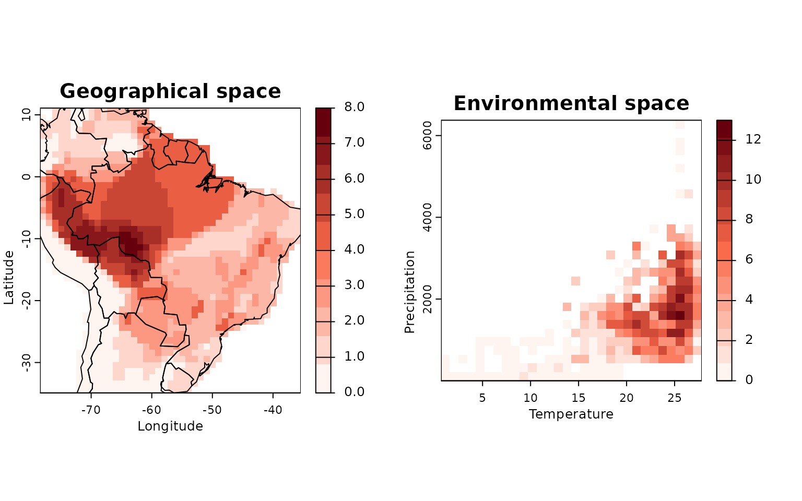
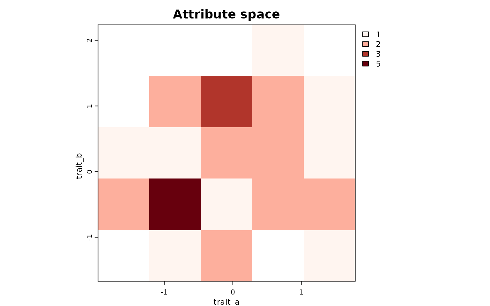
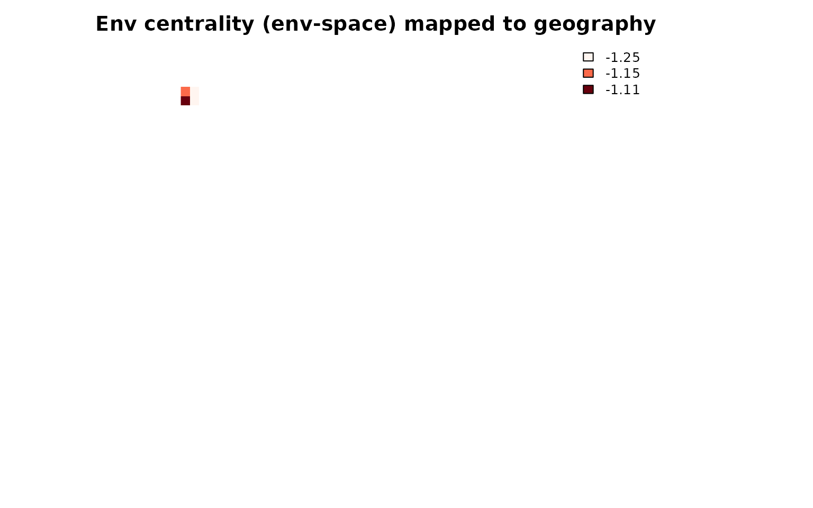
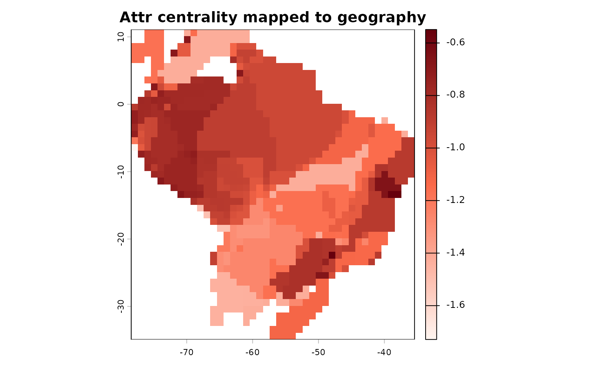

# Cross-mapping biodiversity metrics across spaces

## Overview

This vignette demonstrates **cross-mapping** of biodiversity metrics
between **environmental**, **geographic**, and **attribute (trait)**
spaces using `letsR`. We:

1.  Build an environmental-space PAM from *Phyllomedusa* data;
2.  Compute per-cell descriptors in environmental space;
3.  Summarize those descriptors to **species level**; and
4.  **Project** (cross-map) a chosen environmental metric into
    **geographic** and **attribute** spaces via the package connectors.

------------------------------------------------------------------------

## Data and environmental PAM (example with Phyllomedusa)

First we create a geographic and environmental PAM as described in
previous articles.

``` r
library(letsR)

# Occurrences and climate
data("Phyllomedusa"); data("prec"); data("temp")
prec <- terra::unwrap(prec); temp <- terra::unwrap(temp)

# Geographic PAM (keep empty cells)
PAM  <- lets.presab(Phyllomedusa, remove.cells = FALSE)

# Keep terrestrial landmasses for plotting and binning consistency
wrld_simpl <- get(utils::data("wrld_simpl", package = "letsR"))
PAM <- lets.pamcrop(PAM, terra::vect(wrld_simpl))

# Environmental variables matrix (per geographic cell)
envs <- lets.addvar(PAM, c(temp, prec), onlyvar = TRUE)
colnames(envs) <- c("Temperature", "Precipitation")

# Environmental-space PAM (envPAM)
env_obj <- lets.envpam(PAM, envs, n_bins = 30)

# Plot
lets.plot.envpam(env_obj, world = TRUE)
```



------------------------------------------------------------------------

## Environmental descriptors per environmental cell

``` r
# Compute env-space descriptors (centrality, border, isolation, etc.)
env_cells <- lets.envcells(env_obj, perc = 0.2)

head(env_cells)
#>     Cell_env Frequency Isolation (Min.) Isolation (1st Qu.) Isolation (Median)
#> 269      269         1               NA                  NA                 NA
#> 387      387         1               NA                  NA                 NA
#> 389      389         1               NA                  NA                 NA
#> 417      417         1               NA                  NA                 NA
#> 418      418         1               NA                  NA                 NA
#> 419      419         3         110575.8            110891.1           111206.5
#>     Isolation (Mean) Isolation (3rd Qu.) Isolation (Max.)
#> 269               NA                  NA               NA
#> 387               NA                  NA               NA
#> 389               NA                  NA               NA
#> 417               NA                  NA               NA
#> 418               NA                  NA               NA
#> 419         126211.2            134028.9         156851.3
#>     Weighted Mean Distance to midpoint Mean Distance to midpoint
#> 269                          -3.262939                 -3.410333
#> 387                          -2.245394                 -2.356311
#> 389                          -2.326724                 -2.517317
#> 417                          -2.005706                 -2.125599
#> 418                          -2.038854                 -2.204236
#> 419                          -2.096356                 -2.302793
#>     Minimum Zero Distance Minimum 10% Zero Distance Distance to MCP border
#> 269                    NA                        NA                      0
#> 387                    NA                        NA                      0
#> 389                    NA                        NA                      0
#> 417                    NA                        NA                      0
#> 418                    NA                        NA                      0
#> 419                    NA                        NA                      0
#>     Frequency Weighted Distance
#> 269                    3.329758
#> 387                    2.357255
#> 389                    2.408900
#> 417                    2.130913
#> 418                    2.143140
#> 419                    2.187567
```

Summarize those per-cell descriptors to species level by aggregating
across the environmental cells each species occupies:

``` r
# Species-level summaries (e.g., mean across occupied env cells)
env_by_species <- lets.summaryze.cells(env_obj, env_cells, func = mean)

head(env_by_species)
#>                    Species Frequency Isolation (Min.) Isolation (1st Qu.)
#> 1    Phyllomedusa araguari       NaN              NaN                 NaN
#> 2 Phyllomedusa atelopoides       NaN              NaN                 NaN
#> 3      Phyllomedusa ayeaye       NaN              NaN                 NaN
#> 4      Phyllomedusa azurea       NaN              NaN                 NaN
#> 5     Phyllomedusa bahiana       NaN              NaN                 NaN
#> 6      Phyllomedusa baltea       NaN              NaN                 NaN
#>   Isolation (Median) Isolation (Mean) Isolation (3rd Qu.) Isolation (Max.)
#> 1                NaN              NaN                 NaN              NaN
#> 2                NaN              NaN                 NaN              NaN
#> 3                NaN              NaN                 NaN              NaN
#> 4                NaN              NaN                 NaN              NaN
#> 5                NaN              NaN                 NaN              NaN
#> 6                NaN              NaN                 NaN              NaN
#>   Weighted Mean Distance to midpoint Mean Distance to midpoint
#> 1                                NaN                       NaN
#> 2                                NaN                       NaN
#> 3                                NaN                       NaN
#> 4                                NaN                       NaN
#> 5                                NaN                       NaN
#> 6                                NaN                       NaN
#>   Minimum Zero Distance Minimum 10% Zero Distance Distance to MCP border
#> 1                   NaN                       NaN                    NaN
#> 2                   NaN                       NaN                    NaN
#> 3                   NaN                       NaN                    NaN
#> 4                   NaN                       NaN                    NaN
#> 5                   NaN                       NaN                    NaN
#> 6                   NaN                       NaN                    NaN
#>   Frequency Weighted Distance
#> 1                         NaN
#> 2                         NaN
#> 3                         NaN
#> 4                         NaN
#> 5                         NaN
#> 6                         NaN
```

We will use one metric from `env_by_species`(for example, “Weighted Mean
Distance to midpoint”) for cross-mapping.

------------------------------------------------------------------------

## Attribute-space PAM for Phyllomedusa species

We create a trait grid (attribute space) by simulating two quantitative
traits for the species present in our PAM. (Replace with real traits if
available.)

``` r
set.seed(123)
sp_vec   <- env_by_species$Species                    # species present in PAM
n_sp     <- length(sp_vec)
trait_a  <- rnorm(n_sp)
trait_b  <- trait_a * 0.2 + rnorm(n_sp)               # correlated trait

attr_df  <- data.frame(Species = sp_vec,
                       trait_a  = trait_a,
                       trait_b  = trait_b)

# Attribute-space PAM (AttrPAM)
attr_obj <- lets.attrpam(attr_df, n_bins = 5, remove.cells = FALSE)

# Richness map in attribute space
lets.plot.attrpam(attr_obj)
```



------------------------------------------------------------------------

## Cross-mapping an environmental metric into geographic and attribute spaces

### A. Into geographic space

Project environmental metric to geography:

``` r
# Align env-cell descriptors to the order of geographic rows
env_cells_geo <- env_cells[ env_obj$Presence_and_Absence_Matrix_geo[, 1], ]

# Template = geographic richness raster
map_richatt2 <- env_obj$Geo_Richness_Raster
terra::values(map_richatt2) <- NA

# Fill geographic cells with the env-space metric (species-level NOT needed here)
terra::values(map_richatt2)[ env_obj$Presence_and_Absence_Matrix_geo[, 2] ] <-
  env_cells_geo$`Weighted Mean Distance to midpoint`

# Palette and plot
colfunc <- grDevices::colorRampPalette(c("#fff5f0", "#fb6a4a", "#67000d"))
plot(map_richatt2, col = colfunc(200), box = FALSE, axes = FALSE,
     main = "Env centrality (env-space) mapped to geography")
```



### B. Into attribute space

Map the same environmental metric (species-level) into the attribute
grid:

``` r
met_env <- env_by_species$`Weighted Mean Distance to midpoint` 
sp_names <- env_by_species$Species

attr_map <- lets.maplizer.attr(attr_obj, y = met_env, z = sp_names, func = mean)

# Visualize
lets.plot.attrpam(attr_map, mar = c(4,4,4,4))
```


These projections reveal how a descriptor computed in environmental
space (centrality) distributes across geographic communities and trait
space.

------------------------------------------------------------------------

## Cross-mapping attribute metrics back to geography

You can compute attribute-space descriptors with
`lets.attrcells(attr_obj, ...)`, summarize them to species with
`lets.summarizer.cells(attr_obj, ...)`, and then project those
species-level metrics to geographic or environmental spaces using
`lets.maplizer(...)` or `lets.maplizer.env(...)`.

``` r
# Attribute-space descriptors per cell
attr_cells <- lets.attrcells(attr_obj, perc = 0.2)

# Species-level summaries of attribute-space descriptors
attr_by_species <- lets.summaryze.cells(attr_obj, attr_cells, func = mean)

# Example: map an attribute-space centrality back to geography
met_attr <- attr_by_species$`Weighted Mean Distance to midpoint`
geo_from_attr <- lets.maplizer(PAM, y = met_attr, z = attr_by_species$Species, ras = TRUE)

plot(geo_from_attr$Raster, main = "Attr centrality mapped to geography", col = colfunc(200))
```


