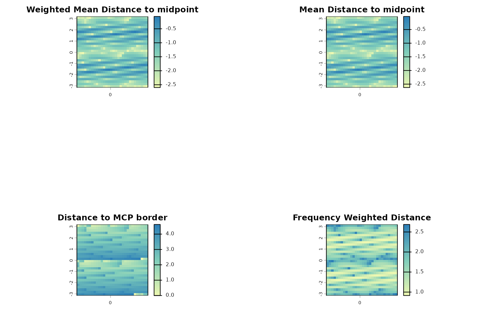

# Mapping species richness in attribute space

## Overview

Species richness and community structure can also be represented in
attribute space, where axes correspond to any quantitative information
that can be attributed to a species. The `letsR` package provides tools
to construct and analyze presence–absence matrices (PAMs) in attribute
space, allowing researchers to examine biodiversity patterns beyond
geography and environment.

This vignette demonstrates how to:

1.  Build a PAM in attribute space using
    [`lets.attrpam()`](https://brunovilela.github.io/letsR/reference/lets.attrpam.md);
2.  Visualize species richness with
    [`lets.plot.attrpam()`](https://brunovilela.github.io/letsR/reference/lets.plot.attrpam.md);
3.  Compute descriptors per attribute cell using
    [`lets.attrcells()`](https://brunovilela.github.io/letsR/reference/lets.attrcells.md);
4.  Aggregate descriptors to the species level with
    `lets.summarizer.cells()`; and
5.  Cross-map attribute metrics to geographic space for integrative
    analysis.

``` r
# Load the package
library(letsR)
```

## Simulating trait data and building the AttrPAM

We begin by generating a dataset of 2,000 species with two correlated
traits:

``` r
set.seed(123)
n <- 2000
Species  <- paste0("sp", 1:n)
trait_a  <- rnorm(n)
trait_b  <- trait_a * 0.2 + rnorm(n)
df       <- data.frame(Species, trait_a, trait_b)

# Build the attribute-space PAM
attr_obj <- lets.attrpam(df, n_bins = 30)
```

## Visualizing richness in attribute space

The
[`lets.plot.attrpam()`](https://brunovilela.github.io/letsR/reference/lets.plot.attrpam.md)
function plots the richness surface across the bivariate trait space.

``` r
lets.plot.attrpam(attr_obj)
```


Each cell represents a unique combination of traits (binned values of
`trait_a` and `trait_b`), and the color intensity indicates the number
of species falling within that bin.

## Computing attribute-space descriptors

The function
[`lets.attrcells()`](https://brunovilela.github.io/letsR/reference/lets.attrcells.md)
quantifies structural properties of each cell in the trait space,
including measures of centrality, isolation, and border proximity.

``` r
attr_desc <- lets.attrcells(attr_obj, perc = 0.2)
head(attr_desc)
#>    Cell_attr Richness Weighted Mean Distance to midpoint
#> 9          9        1                          -2.430272
#> 16        16        1                          -2.263870
#> 19        19        1                          -2.346087
#> 46        46        1                          -2.110248
#> 85        85        1                          -2.500111
#> 86        86        1                          -2.599534
#>    Mean Distance to midpoint Minimum Zero Distance Minimum 10% Zero Distance
#> 9                  -2.470738                    NA                        NA
#> 16                 -2.303493                    NA                        NA
#> 19                 -2.382784                    NA                        NA
#> 46                 -2.149809                    NA                        NA
#> 85                 -2.526725                    NA                        NA
#> 86                 -2.624668                    NA                        NA
#>    Distance to MCP border Frequency Weighted Distance
#> 9                0.000000                    2.552447
#> 16               1.079741                    2.381929
#> 19               1.542487                    2.453701
#> 46               1.090687                    2.237495
#> 85               2.487158                    2.591743
#> 86               2.640287                    2.686964
```

We can visualize these metrics using
[`lets.plot.attrcells()`](https://brunovilela.github.io/letsR/reference/lets.plot.attrcells.md):

``` r
lets.plot.attrcells(attr_obj, attr_desc)
```



Each panel represents a different descriptor (e.g., distance to
midpoint, distance to border, weighted isolation) mapped across the
trait space.

## Summarizing descriptors by species

To derive species-level summaries, we can aggregate descriptor values
across all cells occupied by each species using the
`lets.summarizer.cells()` function.

``` r
attr_desc_by_sp <- lets.summaryze.cells(attr_obj, attr_desc, func = mean)
head(attr_desc_by_sp)
#>   Species Richness Weighted Mean Distance to midpoint Mean Distance to midpoint
#> 1     sp1      NaN                                NaN                       NaN
#> 2     sp2      NaN                                NaN                       NaN
#> 3     sp3      NaN                                NaN                       NaN
#> 4     sp4      NaN                                NaN                       NaN
#> 5     sp5      NaN                                NaN                       NaN
#> 6     sp6      NaN                                NaN                       NaN
#>   Minimum Zero Distance Minimum 10% Zero Distance Distance to MCP border
#> 1                   NaN                       NaN                    NaN
#> 2                   NaN                       NaN                    NaN
#> 3                   NaN                       NaN                    NaN
#> 4                   NaN                       NaN                    NaN
#> 5                   NaN                       NaN                    NaN
#> 6                   NaN                       NaN                    NaN
#>   Frequency Weighted Distance
#> 1                         NaN
#> 2                         NaN
#> 3                         NaN
#> 4                         NaN
#> 5                         NaN
#> 6                         NaN
```

This produces a data frame in which each row corresponds to a species,
and each column corresponds to the mean descriptor value across the
cells where that species occurs.

## References

Vilela, B. & Villalobos, F. (2015). letsR: a new R package for data
handling and analysis in macroecology. Methods in Ecology and Evolution,
6(10), 1229–1234.
